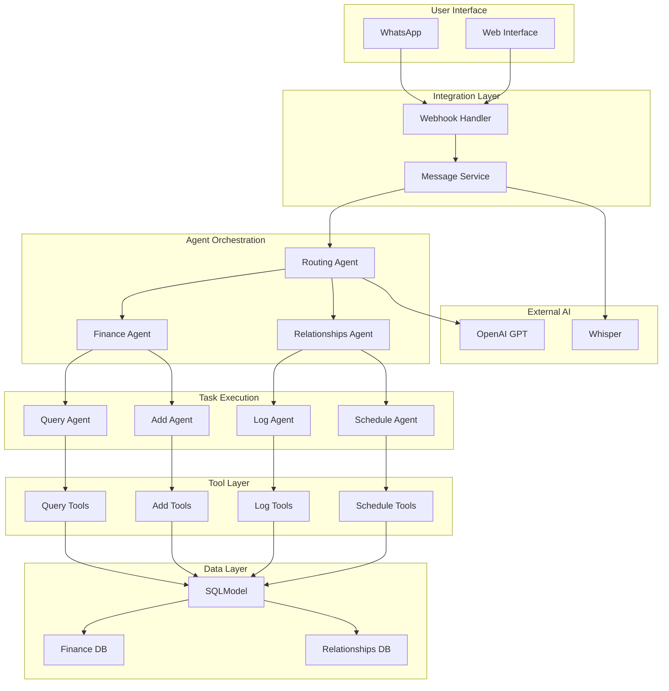
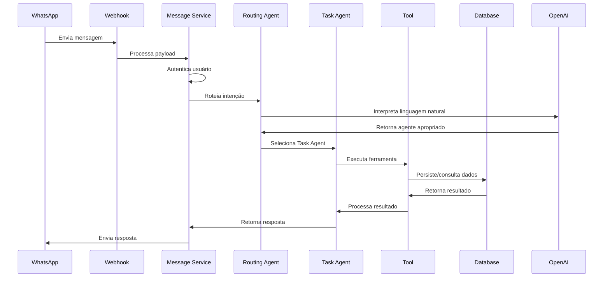
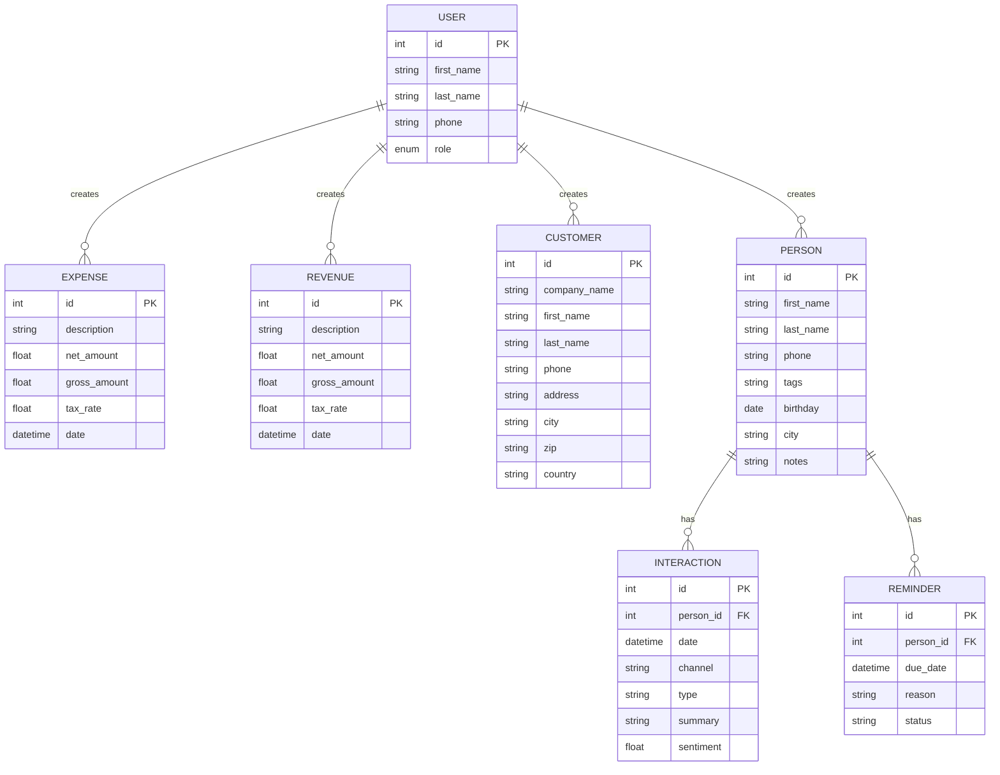
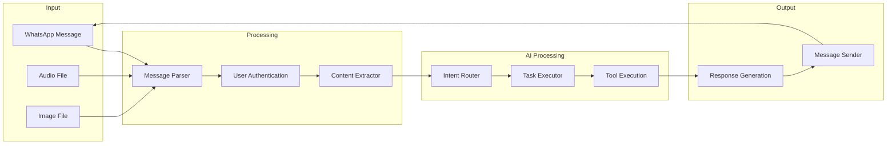
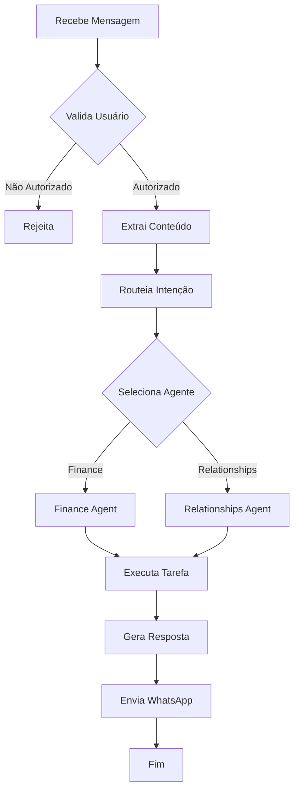
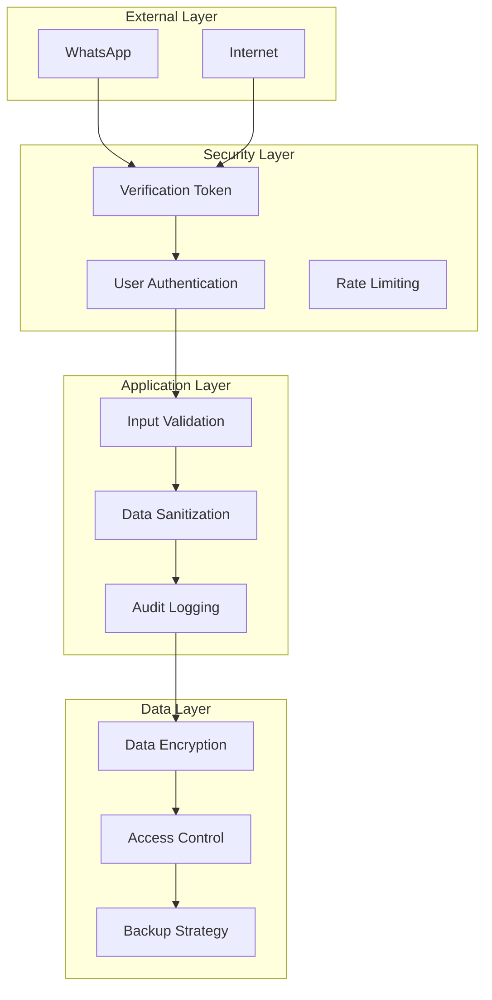
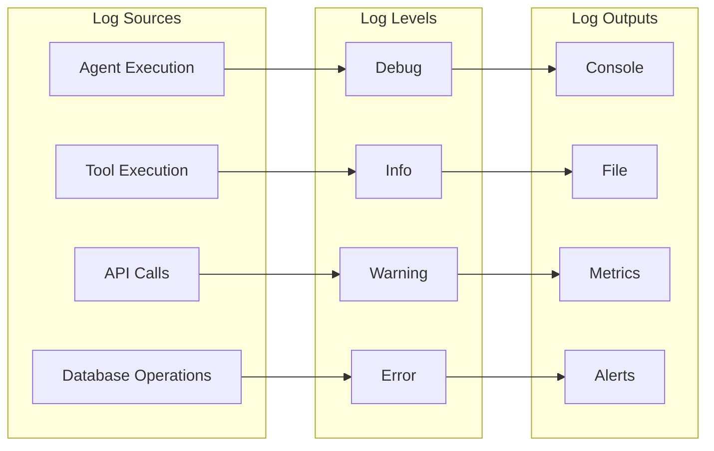
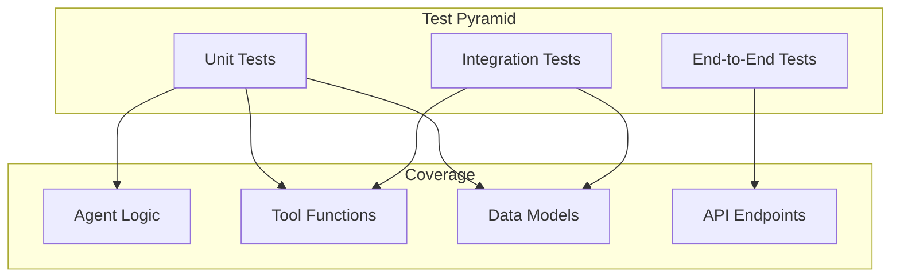
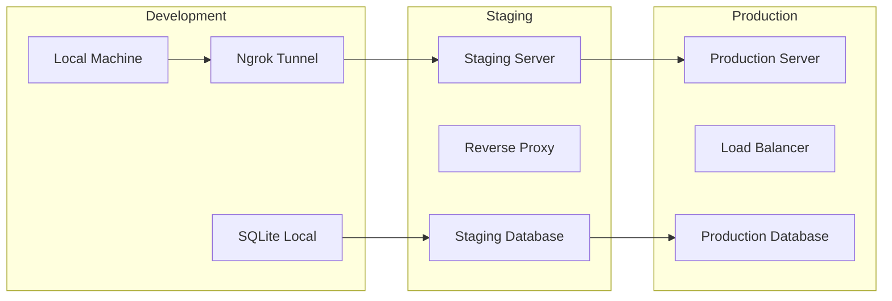
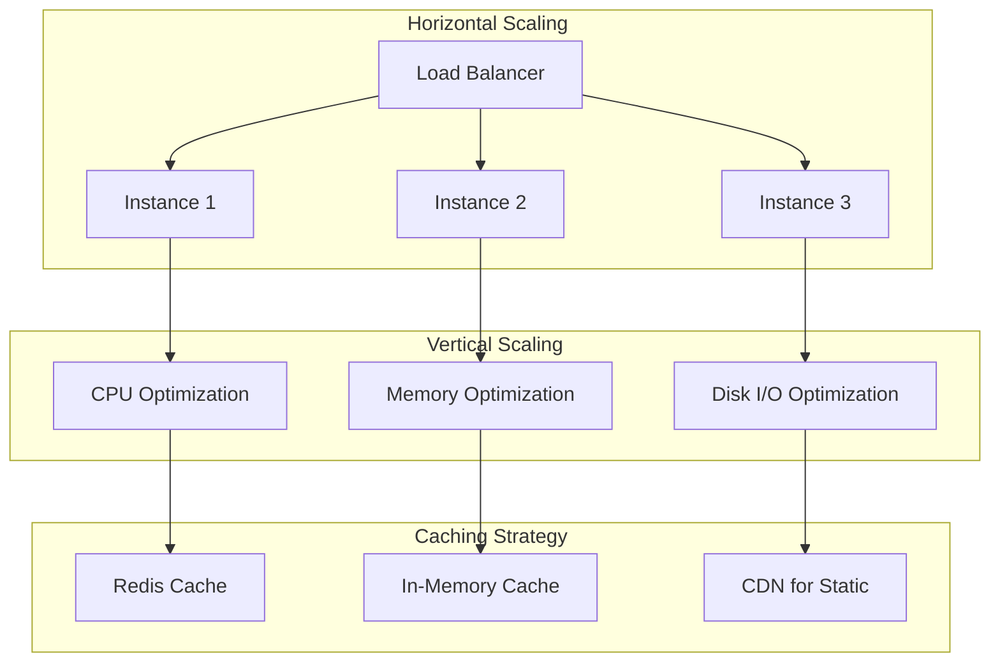

# Arquitetura do WhatsApp Agent

## 🏗️ Visão Geral da Arquitetura

O WhatsApp Agent é um sistema de agentes inteligentes baseado em arquitetura de domínio limpo (Clean Domain Architecture) que implementa um padrão de orquestração de IA para gerenciamento de tarefas pessoais via WhatsApp. O sistema utiliza uma arquitetura em camadas com separação clara de responsabilidades e padrões de design orientados a agentes.

## 🎯 Conceitos Arquiteturais Aplicados

### **1. Domain-Driven Design (DDD)**
- **Bounded Contexts**: Features isoladas (Finance, Relationships)
- **Aggregates**: Entidades principais com regras de negócio
- **Value Objects**: Campos específicos com validações
- **Domain Services**: Lógica de negócio encapsulada

### **2. Clean Architecture**
- **Independência de Frameworks**: FastAPI como detalhe de implementação
- **Independência de UI**: Interface WhatsApp como camada externa
- **Independência de Banco**: SQLModel como abstração de dados
- **Independência de Agentes Externos**: OpenAI como serviço externo

### **3. Multi-Agent System (MAS)**
- **RoutingAgent**: Orquestrador de intenções
- **TaskAgent**: Executores especializados
- **Tool**: Ferramentas de execução
- **Cooperação**: Agentes trabalham em conjunto
- **LangChain Integration**: Padronização com LangChain OpenAI para melhor integração
- **Tool Consolidation**: Sistema de report_tool para consolidação automática de resultados

### **4. Event-Driven Architecture**
- **Webhooks**: Recebimento de mensagens WhatsApp
- **Background Tasks**: Processamento assíncrono
- **Event Sourcing**: Histórico de execução dos agentes

## 🏛️ Estrutura de Camadas

```
┌─────────────────────────────────────────────────────────────┐
│                    PRESENTATION LAYER                       │
├─────────────────────────────────────────────────────────────┤
│  FastAPI Webhook Endpoints                                 │
│  • /webhook (POST) - Recebe mensagens WhatsApp            │
│  • /webhook (GET) - Verificação do webhook                │
│  • /health, /readiness - Health checks                    │
└─────────────────────────────────────────────────────────────┘
┌─────────────────────────────────────────────────────────────┐
│                    APPLICATION LAYER                        │
├─────────────────────────────────────────────────────────────┤
│  Message Service                                           │
│  • Autenticação de usuários                               │
│  • Roteamento para agentes                                │
│  • Transcrição de áudio                                   │
│  • Envio de respostas                                     │
└─────────────────────────────────────────────────────────────┘
┌─────────────────────────────────────────────────────────────┐
│                     DOMAIN LAYER                            │
├─────────────────────────────────────────────────────────────┤
│  Agents & Tools                                           │
│  • RoutingAgent - Orquestração                            │
│  • TaskAgent - Execução especializada                     │
│  • Tool - Ferramentas de execução                         │
│  • Base Classes - Abstrações comuns                       │
└─────────────────────────────────────────────────────────────┘
┌─────────────────────────────────────────────────────────────┐
│                   INFRASTRUCTURE LAYER                      │
├─────────────────────────────────────────────────────────────┤
│  External Services                                         │
│  • OpenAI GPT + LangChain - Processamento de linguagem    │
│  • WhatsApp Business API - Comunicação                    │
│  • SQLite - Persistência de dados                         │
│  • Ngrok - Túnel para desenvolvimento                     │
└─────────────────────────────────────────────────────────────┘
```

## 🧠 Padrão de Agentes Inteligentes

### **Arquitetura de Agentes**



### **Fluxo de Execução**



## 🏢 Estrutura de Domínios

### **Domain Core (app/domain/)**

```
app/domain/
├── agents/           # Agentes base e abstrações
│   ├── agent.py     # Agent - Agente base com LangChain
│   ├── routing.py   # RoutingAgent - Orquestrador de intenções
│   ├── task.py      # TaskAgent - Executor de tarefas
│   └── utils.py     # Utilitários para agentes
├── tools/            # Ferramentas base
│   ├── tool.py      # Tool - Classe base para ferramentas
│   ├── report_tool.py # Ferramenta de relatório padrão
│   └── utils/       # Utilitários para ferramentas
├── message_service.py # Serviço de mensagens
└── exceptions.py     # Exceções de domínio
```

### **Feature Domains (app/feature/)**

```
app/feature/
├── finance/          # Domínio financeiro
│   ├── domain/      # Agentes e ferramentas financeiras
│   └── persistence/ # Modelos e banco financeiro
└── relationships/    # Domínio de relacionamentos
    ├── domain/      # Agentes e ferramentas de relacionamento
    └── persistence/ # Modelos e banco de relacionamentos
```

## 🔧 Padrões de Design Implementados

### **1. Strategy Pattern**
- **RoutingAgent**: Estratégias diferentes para diferentes tipos de intenção
- **TaskAgent**: Estratégias diferentes para diferentes tipos de tarefa
- **Tool**: Estratégias diferentes para diferentes operações

### **2. Factory Pattern**
- **Tool Creation**: Ferramentas criadas dinamicamente
- **Agent Creation**: Agentes instanciados com configurações específicas
- **Model Validation**: Validação automática via Pydantic

### **3. Observer Pattern**
- **Step History**: Histórico de execução dos agentes
- **Event Logging**: Logs de eventos e resultados
- **Background Tasks**: Processamento assíncrono de mensagens

### **4. Template Method Pattern**
- **OpenAIAgent.run()**: Template para execução de agentes
- **Tool.run()**: Template para execução de ferramentas
- **TaskAgent.load_agent()**: Template para carregamento de agentes

### **5. Dependency Injection**
- **Tool Injection**: Ferramentas injetadas nos agentes
- **Client Injection**: Cliente OpenAI injetado nos agentes
- **Context Injection**: Contexto injetado nas execuções

## 🗄️ Modelo de Dados

### **Esquema Geral do Sistema**



### **Separação de Bancos**
- **`finance_app.db`**: Dados financeiros (Expense, Revenue, Customer)
- **`relationships_app.db`**: Dados de relacionamentos (Person, Interaction, Reminder)
- **Isolamento**: Cada feature tem seu próprio banco para independência
- **Inicialização Controlada**: Bancos são criados sob demanda para evitar conflitos

## 🔄 Fluxo de Dados

### **Pipeline de Processamento**



### **Fluxo de Decisão**



## 🚀 Padrões de Integração

### **1. Webhook Integration**
- **Verificação**: Token de verificação para segurança
- **Validação**: Timestamp para evitar mensagens antigas
- **Processamento**: Background tasks para não bloquear

### **2. AI Integration**
- **OpenAI GPT**: Roteamento de intenções e execução de tarefas (completo)
- **Google Gemini**: Suporte limitado com limitações de tool calling
- **Whisper**: Transcrição de áudio para processamento
- **Function Calling**: Execução estruturada de ferramentas
- **Schema Resolution**: Resolução automática de referências JSON para compatibilidade

### **3. Database Integration**
- **SQLModel**: ORM moderno com validação Pydantic
- **SQLite**: Banco local para desenvolvimento e MVP
- **Migrations**: Criação automática de tabelas

### **4. External API Integration**
- **WhatsApp Business API**: Comunicação bidirecional
- **Meta Graph**: Autenticação e webhooks
- **Ngrok**: Túnel para desenvolvimento local

## 🔒 Segurança e Autenticação

### **Camadas de Segurança**



### **Mecanismos de Segurança**
- **Verification Token**: Validação de webhooks WhatsApp
- **User Authentication**: Controle por número de telefone
- **Input Validation**: Validação Pydantic em todos os inputs
- **Rate Limiting**: Proteção contra spam
- **Data Isolation**: Bancos separados por feature

## 📊 Monitoramento e Observabilidade

### **Logging Strategy**



### **Métricas de Performance**
- **Response Time**: Tempo de processamento das mensagens
- **Success Rate**: Taxa de sucesso das operações
- **Error Rate**: Taxa de erro por tipo de operação
- **Resource Usage**: Uso de memória e CPU

## 🔄 Padrões de Resiliência

### **1. Circuit Breaker**
- **OpenAI API**: Proteção contra falhas da API externa
- **WhatsApp API**: Proteção contra falhas de comunicação
- **Database**: Proteção contra falhas de persistência

### **2. Retry Pattern**
- **API Calls**: Tentativas múltiplas para APIs externas
- **Database Operations**: Retry para operações de banco
- **Message Processing**: Retry para processamento de mensagens

### **3. Fallback Strategy**
- **AI Unavailable**: Fallback para respostas padrão
- **Database Unavailable**: Cache local temporário
- **External Service Down**: Modo offline limitado

## 🧪 Estratégia de Testes

### **Pirâmide de Testes**



### **Tipos de Teste**
- **Unit Tests**: Lógica de agentes e ferramentas
- **Integration Tests**: Interação entre componentes
- **End-to-End Tests**: Fluxo completo de mensagens
- **Performance Tests**: Latência e throughput

## 🚀 Estratégia de Deploy

### **Ambientes**



### **CI/CD Pipeline**
- **Build**: Compilação e validação de código
- **Test**: Execução automática de testes
- **Deploy**: Deploy automático para staging
- **Promote**: Promoção manual para produção

## 📈 Escalabilidade e Performance

### **Estratégias de Escalabilidade**



### **Otimizações de Performance**
- **Async Processing**: Background tasks para mensagens
- **Connection Pooling**: Pool de conexões de banco
- **Caching**: Cache de respostas frequentes
- **Batch Processing**: Processamento em lote quando possível

## 🔮 Roadmap Arquitetural

### **Fase 1: Consolidação (Atual)**
- ✅ Arquitetura base implementada
- ✅ Features Finance e Relationships funcionais
- ✅ Padrões de agentes estabelecidos
- ✅ Migração para LangChain OpenAI
- ✅ Correção de validações de ferramentas
- ✅ Isolamento de bancos de dados
- ✅ Suporte a Google Gemini (com limitações)
- ✅ Sistema de consolidação report_tool
- ✅ Resolução de schemas JSON para compatibilidade

### **Fase 2: Escalabilidade**
- [ ] Migração para PostgreSQL/MySQL
- [ ] Implementação de cache Redis
- [ ] Load balancing e auto-scaling
- [ ] Monitoramento avançado

### **Fase 3: Microserviços**
- [ ] Separação em serviços independentes
- [ ] API Gateway centralizado
- [ ] Service mesh para comunicação
- [ ] Deploy com Kubernetes

### **Fase 4: IA Avançada**
- [ ] Fine-tuning de modelos
- [ ] Embeddings para busca semântica
- [ ] Análise preditiva de relacionamentos
- [ ] Recomendações personalizadas

---

**Documento de Arquitetura**  
**Versão**: 1.0  
**Última atualização**: Janeiro 2025  
**Status**: Implementado e funcional  
**Arquitetura**: Clean Domain + Multi-Agent System + Tool Consolidation
