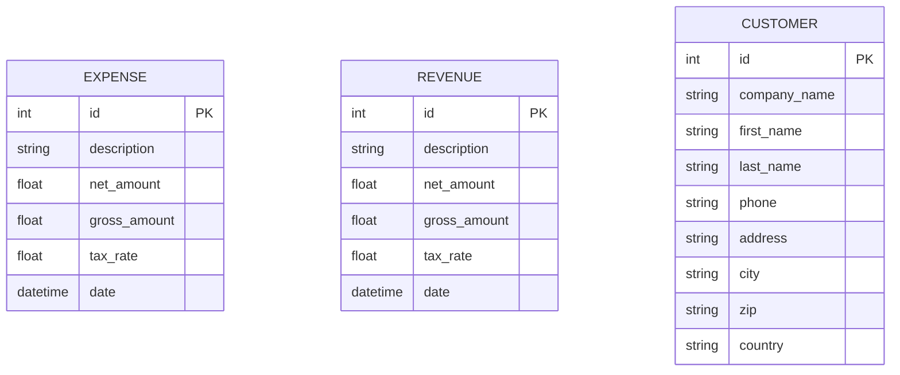
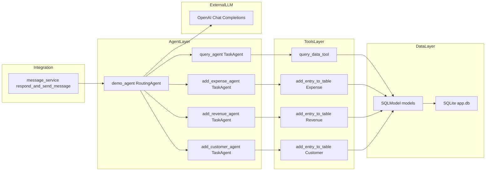

## Gestão de Receitas e Despesas – Guia de Uso

Este guia detalha a funcionalidade de gestão financeira do agente descrito em `ARCHITECTURE.md` e oferece sugestões práticas de uso pelo WhatsApp.

### O que o agente faz
- **Consulta** despesas, receitas e clientes (leitura de dados).
- **Adiciona** novas despesas, receitas e clientes (criação de dados).
- **Roteia automaticamente** o pedido para a ferramenta certa com base no texto do usuário.

Referências técnicas:
- Agentes: `query_agent`, `add_expense_agent`, `add_revenue_agent`, `add_customer_agent`.
- Modelos: `Expense`, `Revenue`, `Customer` (SQLModel/SQLite em `app.db`).

### Entidades e campos
- Expense: `description`, `net_amount`, `gross_amount`, `tax_rate`, `date`.
- Revenue: `description`, `net_amount`, `gross_amount`, `tax_rate`, `date`.
- Customer: `company_name`, `first_name`, `last_name`, `phone`, `address`, `city`, `zip`, `country`.

### Regras de negócio relevantes
- Imposto padrão considerado: **tax_rate = 0.19** (19%).
- Cálculos automáticos (validações em `persistance/models.py`):
  - Se informar `net_amount` + `tax_rate` ⇒ o sistema calcula `gross_amount`.
  - Se informar `gross_amount` + `tax_rate` ⇒ o sistema calcula `net_amount`.
  - Se informar `net_amount` + `gross_amount` ⇒ o sistema infere `tax_rate`.
- No agente de despesas: espera-se que o usuário forneça preferencialmente o **net amount**; o sistema calcula o valor bruto.
- No agente de receitas: espera-se que o usuário forneça preferencialmente o **gross amount**; o sistema calcula o valor líquido.

### Formatos aceitos
- Data: `YYYY-MM-DD`, `YYYY-MM-DD HH:MM:SS` ou `YYYY-MM-DDTHH:MM:SZ`.
- Números: inteiros ou decimais com ponto (ex.: `199.90`).

### Fluxos suportados
1) Consultar dados (query_agent)
   - Exemplos: listar, filtrar por datas, somar totais, mostrar últimos lançamentos.
2) Adicionar despesa (add_expense_agent)
   - Usa `net_amount` e `tax_rate` para calcular `gross_amount` (taxa padrão 0.19, se não especificada).
3) Adicionar receita (add_revenue_agent)
   - Usa `gross_amount` e `tax_rate` para calcular `net_amount` (taxa padrão 0.19, se não especificada).
4) Adicionar cliente (add_customer_agent)
   - Cria novos registros para facilitar associação futura.

### Exemplos de mensagens (WhatsApp)
Consultas:
- "Liste minhas despesas deste mês"
- "Total de receitas entre 2024-01-01 e 2024-03-31"
- "Quais foram as 5 maiores despesas de 2024?"
- "Mostre as receitas do dia 2024-07-10"

Adicionar despesa:
- "Adicionar despesa: descrição=Almoço com cliente, net=120.00, data=2024-07-10"
- "Nova despesa de combustível 300.00 em 2024-07-09 com taxa 0.19 (valor líquido)"

Adicionar receita:
- "Adicionar receita: descrição=Projeto ACME, gross=10000.00, data=2024-07-15"
- "Registrar receita de venda 1599.90 hoje (valor bruto)"

Adicionar cliente:
- "Cadastrar cliente: João Silva, phone=5511999999999, address=Rua X, 100, São Paulo"

Perguntas úteis:
- "Quanto gastei na última semana?"
- "Qual a diferença entre receitas e despesas no mês passado?"
- "Quais clientes tenho cadastrados?"

### Dicas para melhores resultados
- Sempre inclua uma **data** quando cadastrar receitas/despesas.
- Informe **net_amount** para despesas e **gross_amount** para receitas quando possível; o agente calcula o restante.
- Em consultas, inclua **período** (inicio/fim) e, se relevante, limite de itens (ex.: "top 5").
- Use descrições claras para facilitar buscas futuras.

### Limitações e observações
- O banco atual é local (SQLite `app.db`). Em produção, avalie um SGBD gerenciado.
- O reconhecimento de linguagem natural pode pedir esclarecimentos quando faltarem dados essenciais.
- Usuários autorizados são controlados por telefone em `message_service.authenticate_user_by_phone_number`.

### Ideias de evolução
- Categorias de despesas/receitas e relatórios por categoria.
- Vincular despesas/receitas a clientes/projetos.
- Exportação CSV/PDF e dashboards.
- Agendamentos: lembretes de lançamento e fechamento mensal.
- Integração com OCR para ler notas fiscais/faturas a partir de imagens.

### Solução de problemas (FAQ)
- O agente pede mais detalhes: responda com os campos faltantes (ex.: data, valor líquido/bruto).
- Erros de data: prefira `YYYY-MM-DD`.
- Valores: use ponto decimal (ex.: `199.90`).

### Onde encontro mais detalhes
- Arquitetura completa e diagramas: `ARCHITECTURE.md`.

### Diagramas

#### Esquema Financeiro (ER)

#### Dependências diretas do agente (para isolamento)

Observação rápida para substituição do agente:
- Componentes a trocar: `demo_agent` e os `TaskAgent`/ferramentas associados.
- Componentes a manter: `message_service.respond_and_send_message` (contrato de entrada: texto do usuário e id; contrato de saída: texto de resposta), camada de dados e integrações externas.

### Checklist para substituir o agente financeiro
- Definir objetivo do novo agente: escopo funcional, entidades e resultados esperados.
- Manter contrato com `message_service.respond_and_send_message`:
  - Entrada: `user_message` (texto), `user.id`.
  - Saída: string de resposta para envio no WhatsApp.
- Projetar ferramentas e agentes:
  - Mapear quais operações viram `TaskAgent` e quais viram `Tool`.
  - Especificar modelos Pydantic dos argumentos aceitos por cada ferramenta.
- Preparar dados/modelos:
  - Ajustar/estender `SQLModel` se necessário (campos/categorias), com migração de dados planejada.
  - Documentar regras (ex.: impostos) e validações automáticas.
- Implementar novo roteador:
  - Criar `RoutingAgent` dedicado (ex.: `new_demo_agent`) com `system_message`, `examples` e `prompt_extra` adequados.
  - Registrar `TaskAgent` e suas `tools` no novo roteador.
- Estratégia de troca segura:
  - Introduzir flag/ENV para alternar entre `demo_agent` atual e o novo agente.
  - Atualizar `message_service.respond_and_send_message` para escolher o agente via configuração.
- Testes:
  - Unitários das `tools` (cálculos, validações, CRUD via SQLModel).
  - Integração do `RoutingAgent` (seleção correta de ferramentas).
  - Fim-a-fim: do webhook até `send_whatsapp_message` (sem chamar APIs externas em produção; use mocks). 
- Observabilidade e resiliência:
  - Logs das decisões de roteamento e erros de tool/LLM.
  - Timeouts/retries para chamadas externas (OpenAI/Meta Graph) e manejo de falhas.
- Segurança/compliance:
  - Garantir filtragem de usuários autorizados continua funcionando.
  - Privacidade de dados; evitar vazar PII em logs.
- Plano de rollback:
  - Capacidade de voltar para o agente anterior rapidamente (feature flag/env).
  - Backups de `app.db` antes de migrações.

