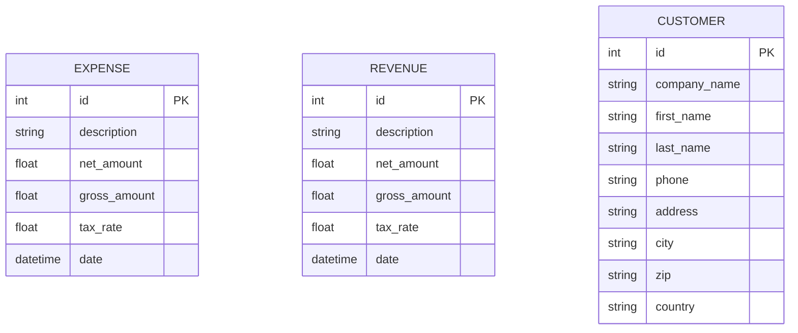
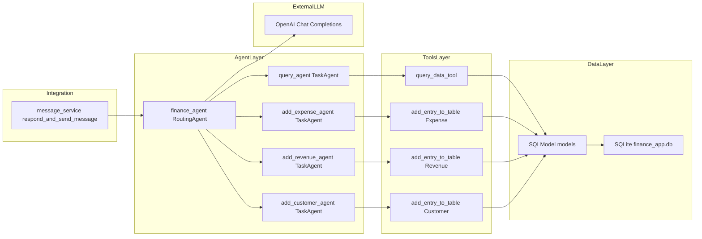

# Gestão de Receitas e Despesas – Guia de Uso

Este guia detalha a funcionalidade de gestão financeira do agente implementado no projeto WhatsApp Agent e oferece sugestões práticas de uso pelo WhatsApp.

## 🎯 O que o agente faz

- **Consulta** despesas, receitas e clientes (leitura de dados)
- **Adiciona** novas despesas, receitas e clientes (criação de dados)
- **Roteia automaticamente** o pedido para a ferramenta certa com base no texto do usuário
- **Calcula automaticamente** impostos e valores líquidos/brutos

## 🏗️ Arquitetura Técnica

### Agentes Implementados
- **`query_agent`**: Consultas em todas as entidades financeiras
- **`add_expense_agent`**: Cadastro de despesas
- **`add_revenue_agent`**: Cadastro de receitas  
- **`add_customer_agent`**: Cadastro de clientes

### Modelos de Dados
- **`Expense`**: Despesas com cálculo automático de impostos
- **`Revenue`**: Receitas com cálculo automático de impostos
- **`Customer`**: Clientes com informações completas

### Banco de Dados
- **SQLite**: `finance_app.db` (local)
- **ORM**: SQLModel para mapeamento objeto-relacional
- **Localização**: Raiz do projeto

## 📊 Entidades e Campos

### Expense (Despesa)
```python
{
    "id": "int (PK)",
    "description": "string",
    "net_amount": "float (valor líquido)",
    "gross_amount": "float (valor bruto)",
    "tax_rate": "float (taxa de imposto)",
    "date": "datetime (data da despesa)"
}
```

### Revenue (Receita)
```python
{
    "id": "int (PK)",
    "description": "string", 
    "net_amount": "float (valor líquido)",
    "gross_amount": "float (valor bruto)",
    "tax_rate": "float (taxa de imposto)",
    "date": "datetime (data da receita)"
}
```

### Customer (Cliente)
```python
{
    "id": "int (PK)",
    "company_name": "string (opcional)",
    "first_name": "string",
    "last_name": "string",
    "phone": "string",
    "address": "string",
    "city": "string",
    "zip": "string",
    "country": "string"
}
```

## ⚖️ Regras de Negócio

### Cálculo Automático de Impostos
- **Taxa padrão**: `tax_rate = 0.19` (19%)
- **Validações automáticas** implementadas em `app/feature/finance/persistence/models.py`:

#### Para Despesas (add_expense_agent)
- **Preferencial**: Usuário fornece `net_amount` + `tax_rate`
- **Sistema calcula**: `gross_amount = net_amount × (1 + tax_rate)`
- **Exemplo**: `net_amount = 100.00, tax_rate = 0.19` → `gross_amount = 119.00`

#### Para Receitas (add_revenue_agent)
- **Preferencial**: Usuário fornece `gross_amount` + `tax_rate`
- **Sistema calcula**: `net_amount = gross_amount ÷ (1 + tax_rate)`
- **Exemplo**: `gross_amount = 1190.00, tax_rate = 0.19` → `net_amount = 1000.00`

#### Cálculos Alternativos
- Se informar `net_amount` + `gross_amount` → sistema infere `tax_rate`
- Se informar apenas um valor → sistema usa `tax_rate = 0.19` como padrão

## 📅 Formatos Aceitos

### Datas
- `YYYY-MM-DD` (ex: `2024-07-15`)
- `YYYY-MM-DD HH:MM:SS` (ex: `2024-07-15 14:30:00`)
- `YYYY-MM-DDTHH:MM:SZ` (ex: `2024-07-15T14:30:00Z`)

### Números
- **Inteiros**: `100`, `1500`
- **Decimais**: `199.90`, `1000.00` (usar ponto como separador decimal)
- **Valores monetários**: Recomendado usar 2 casas decimais

## 🔄 Fluxos Suportados

### 1. Consultar Dados (query_agent)
**Ferramenta**: `query_data_tool`
- **Operações**: listar, filtrar por datas, somar totais, mostrar últimos lançamentos
- **Filtros**: por tabela, colunas específicas, condições WHERE
- **Exemplos**: "listar despesas", "mostrar receitas do mês", "total de gastos"

### 2. Adicionar Despesa (add_expense_agent)
**Ferramenta**: `add_entry_to_table(Expense)`
- **Entrada preferencial**: `net_amount` + `tax_rate`
- **Cálculo automático**: `gross_amount`
- **Taxa padrão**: `0.19` se não especificada

### 3. Adicionar Receita (add_revenue_agent)
**Ferramenta**: `add_entry_to_table(Revenue)`
- **Entrada preferencial**: `gross_amount` + `tax_rate`
- **Cálculo automático**: `net_amount`
- **Taxa padrão**: `0.19` se não especificada

### 4. Adicionar Cliente (add_customer_agent)
**Ferramenta**: `add_entry_to_table(Customer)`
- **Campos obrigatórios**: `first_name`, `last_name`, `phone`, `address`, `city`, `zip`, `country`
- **Campo opcional**: `company_name`

## 💬 Exemplos de Mensagens (WhatsApp)

### Consultas
```
"Liste minhas despesas deste mês"
"Total de receitas entre 2024-01-01 e 2024-03-31"
"Quais foram as 5 maiores despesas de 2024?"
"Mostre as receitas do dia 2024-07-10"
"Quanto gastei na última semana?"
"Qual a diferença entre receitas e despesas no mês passado?"
"Quais clientes tenho cadastrados?"
```

### Adicionar Despesa
```
"Adicionar despesa: descrição=Almoço com cliente, net=120.00, data=2024-07-10"
"Nova despesa de combustível 300.00 em 2024-07-09 com taxa 0.19 (valor líquido)"
"Despesa de almoço 50.00 hoje"
"Combustível 200.00 ontem"
```

### Adicionar Receita
```
"Adicionar receita: descrição=Projeto ACME, gross=10000.00, data=2024-07-15"
"Registrar receita de venda 1599.90 hoje (valor bruto)"
"Receita de projeto 5000.00 esta semana"
"Venda de produto 800.00 ontem"
```

### Adicionar Cliente
```
"Cadastrar cliente: João Silva, phone=5511999999999, address=Rua X, 100, São Paulo"
"Novo cliente: Maria Santos, telefone 21988882222, endereço Rua Y, 200, Rio de Janeiro"
"Cliente: Tech Solutions Inc., João Doe, 123456789, 123 Elm Street, Tech City, 45678, USA"
```

## 💡 Dicas para Melhores Resultados

### Ao Cadastrar
- **Sempre inclua uma data** quando cadastrar receitas/despesas
- **Use valores líquidos** para despesas (`net_amount`)
- **Use valores brutos** para receitas (`gross_amount`)
- **Descrições claras** facilitam buscas futuras

### Em Consultas
- **Inclua período** (início/fim) para resultados mais precisos
- **Use limites** quando relevante (ex: "top 5", "últimas 10")
- **Especifique entidade** se quiser filtrar (ex: "despesas", "receitas", "clientes")

### Formatação
- **Datas**: Prefira `YYYY-MM-DD` para maior compatibilidade
- **Valores**: Use ponto decimal (ex: `199.90`)
- **Telefones**: Formato internacional recomendado (`+55 11 99999-9999`)

## ⚠️ Limitações e Observações

### Banco de Dados
- **Atual**: SQLite local (`finance_app.db`)
- **Produção**: Recomendado migrar para SGBD gerenciado (PostgreSQL, MySQL)

### Reconhecimento de Linguagem
- **Processamento**: OpenAI GPT para interpretação de intenções
- **Clareza**: Pode pedir esclarecimentos quando faltarem dados essenciais
- **Contexto**: Quanto mais específica a mensagem, melhor o resultado

### Autenticação
- **Usuários autorizados**: Controlados por número de telefone
- **Arquivo**: `allowed_users.json` na raiz do projeto
- **Função**: `message_service.authenticate_user_by_phone_number`

## 🚀 Ideias de Evolução

### Funcionalidades
- [ ] **Categorização automática** de despesas/receitas
- [ ] **Relatórios por categoria** e período
- [ ] **Vincular transações** a clientes/projetos
- [ ] **Exportação de dados** (CSV/PDF)
- [ ] **Dashboards web** para visualização

### Automação
- [ ] **Agendamentos**: lembretes de lançamento
- [ ] **Fechamento mensal** automático
- [ ] **Integração com OCR** para notas fiscais
- [ ] **Sincronização** com bancos e cartões

### Análise
- [ ] **Tendências** de gastos e receitas
- [ ] **Comparativos** mensais/anuais
- [ ] **Projeções** baseadas no histórico
- [ ] **Alertas** de orçamento

## 🔧 Solução de Problemas (FAQ)

### Erros Comuns

#### "Agent not found"
**Causa**: Agente não registrado no RoutingAgent
**Solução**: Verificar se o agente está na lista de `tools` do `finance_agent`

#### "Missing values: select_columns, where"
**Causa**: Modelo não tem `arg_model` configurado
**Solução**: Adicionar `arg_model` apropriado ao `TaskAgent`

#### "Webhook não funciona"
**Causa**: Configuração incorreta do Ngrok ou token
**Solução**: Verificar URL do Ngrok e `VERIFICATION_TOKEN`

### Dicas de Debug
- **Ativar modo verbose** nos agentes
- **Verificar logs** do FastAPI
- **Monitorar chamadas** da OpenAI API
- **Validar dados** de entrada

## 📊 Diagramas

### Esquema Financeiro (ER)


### Arquitetura dos Agentes


## 🧪 Testes e Dados Mock

### Carregar Dados de Exemplo
```bash
# Executar script de dados mock
python -m app.feature.finance.persistence.mock_data

# Opções disponíveis
python -m app.feature.finance.persistence.mock_data --db-name "meu_banco.db" --db-path "./databases"
```

### Dados Incluídos
- **5 clientes** com informações completas
- **3 receitas** com diferentes valores e datas
- **3 despesas** com cálculos de impostos
- **3 faturas** vinculadas a clientes

## 📚 Referências Técnicas

### Arquivos do Projeto
- **Modelos**: `app/feature/finance/persistence/models.py`
- **Agentes**: `app/feature/finance/domain/agents/finance_agent.py`
- **Ferramentas**: `app/feature/finance/domain/tools/`
- **Banco**: `app/feature/finance/persistence/db.py`

### Documentação Relacionada
- **[README.md](README.md)**: Visão geral do projeto
- **[RELATIONSHIPS_FEATURE.md](RELATIONSHIPS_FEATURE.md)**: Feature de relacionamentos
- **[instructions.md](instructions.md)**: Configuração da Meta API

## 🔄 Checklist para Manutenção

### Verificações Regulares
- [ ] **Banco de dados**: Verificar integridade e tamanho
- [ ] **Logs**: Monitorar erros e performance
- [ ] **Tokens**: Renovar tokens da OpenAI e Meta API
- [ ] **Backups**: Fazer backup regular do `finance_app.db`

### Atualizações
- [ ] **Dependências**: Manter `requirements.txt` atualizado
- [ ] **Modelos**: Verificar compatibilidade com SQLModel
- [ ] **Agentes**: Testar após mudanças nos prompts
- [ ] **Ferramentas**: Validar funcionalidade das tools

---

**Última atualização**: Janeiro 2025  
**Versão do documento**: 2.0  
**Status**: Implementado e funcional


