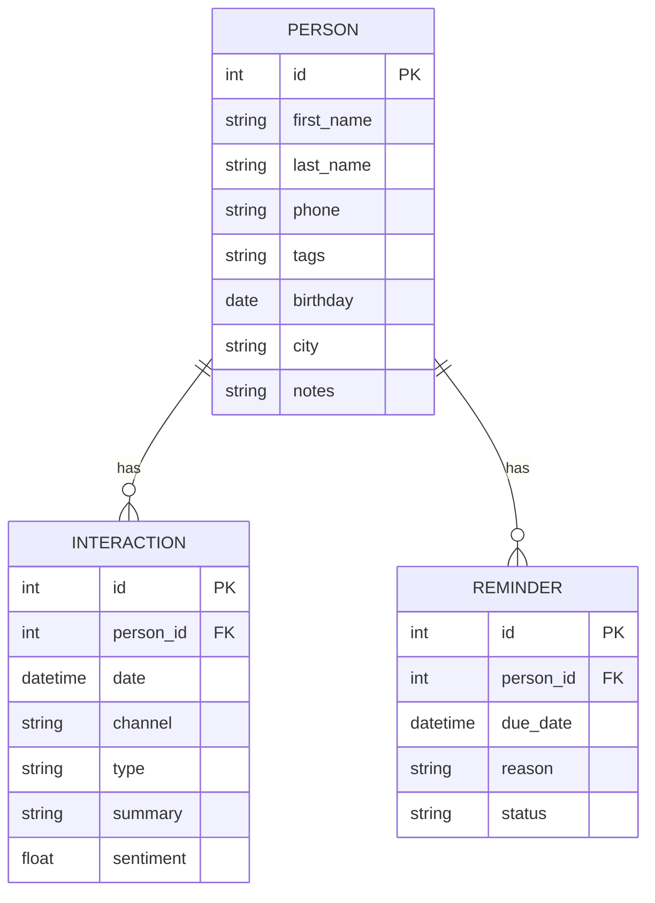
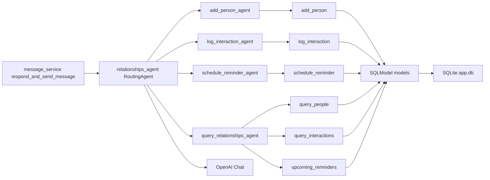

## Agente de Gestão de Relacionamentos Pessoais – Proposta de Feature

### Objetivo
Permitir que o usuário gerencie contatos pessoais, registre interações e programe lembretes de follow up diretamente pelo WhatsApp, com roteamento automático de intenções e uso opcional de LLM para resumo e sentimento.

### Escopo do MVP
- Cadastrar pessoas
- Registrar interações
- Criar lembretes
- Consultar contatos, interações e lembretes futuros

### Como se integra à arquitetura atual
- Entrada e saída preservam o contrato de `message_service.respond_and_send_message`.
- Novo roteador dedicado (ex.: `relationships_agent`) análogo ao `demo_agent` financeiro.
- Reutiliza padrões de ferramentas de consulta e adição já existentes (query e add), com novos modelos.

### Entidades propostas
- Person: `first_name`, `last_name`, `phone`, `tags`, `birthday`, `city`, `notes`
- Interaction: `person_id`, `date`, `channel`, `type`, `summary`, `sentiment`
- Reminder: `person_id`, `due_date`, `reason`, `status`

### Ferramentas e agentes
- add_person_agent → `add_person` (criar contato)
- log_interaction_agent → `log_interaction` (registrar interação, resumo opcional por LLM)
- schedule_reminder_agent → `schedule_reminder` (criar lembrete)
- query_relationships_agent → `query_people`, `query_interactions`, `upcoming_reminders`

### Exemplos de mensagens (WhatsApp)
- Adicionar contato: "Adicionar contato Ana Silva phone 5511999999999 cidade São Paulo tags amiga"
- Registrar interação: "Conversei com João ontem por ligação sobre viagem foi ótimo"
- Lembretes: "Criar lembrete para falar com Maria amanhã motivo aniversário"
- Consultas: "Próximos lembretes desta semana"; "Quando foi meu último contato com Pedro?"; "Listar contatos com tag trabalho"

### Diagrama ER

### Dependências diretas do agente

### Regras e validações
- `phone` deve ser único para Person; normalizar formato E.164 quando possível.
- `sentiment` em Interaction varia de -1 a 1; se não informado, pode ser omitido no MVP.
- `due_date` de Reminder deve ser no futuro para status ativo.

### Implementação sugerida
- Modelos SQLModel novos ou módulo separado (ex.: `persistance/models_relationships.py`).
- Ferramentas seguindo padrão existente:
  - add: função geradora `add_entry_to_table(Model)` (semelhante ao financeiro)
  - query: `query_data_tool` com filtros por `person_id`, `date`, `tags`
  - ferramentas específicas: `schedule_reminder`, `log_interaction`
- Novo `relationships_agent.py` com `RoutingAgent` e `TaskAgent` específicos.
- `message_service.respond_and_send_message`: feature flag para alternar entre agente atual e o novo.

### Privacidade e ética
- Evitar log de PII sensível; mascarar telefones nos logs.
- Consentimento do usuário para guardar interações e lembretes.
- Exportação e exclusão de dados sob demanda do usuário.

### Roadmap de evolução
- Classificação automática de sentimento e tópico via LLM.
- Recorrência em lembretes e notificações proativas.
- Integração com agenda externa (Google Calendar, iCloud).
- Enriquecimento de contatos a partir de histórico do WhatsApp (com consentimento).

### Checklist rápido
- Definir esquema dos modelos e migração do banco.
- Criar ferramentas e `TaskAgent` mapeando intenções principais.
- Escrever exemplos de prompt do `RoutingAgent` para cada ação.
- Conectar ao `message_service` via flag de ativação.
- Testes unitários das ferramentas e integração end to end.

