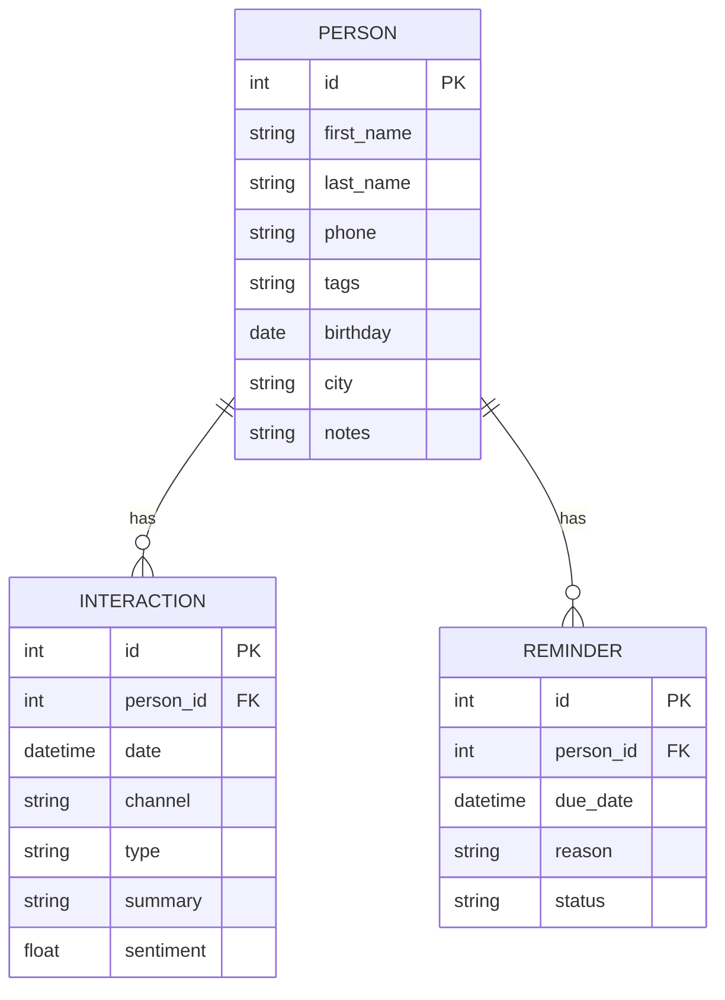
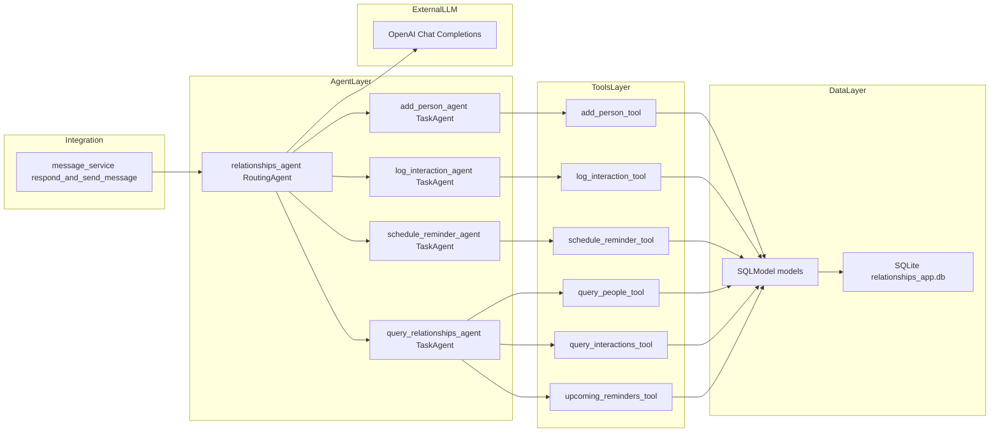

# Agente de Gestão de Relacionamentos Pessoais – Guia de Uso

## 🎯 Objetivo

Sistema de assistente social pessoal que permite ao usuário gerenciar contatos pessoais, registrar interações e programar lembretes de follow-up diretamente pelo WhatsApp. O agente atua como um "CRM pessoal" para tornar os relacionamentos mais intencionais e menos deixados ao acaso.

## 🚀 Funcionalidades Implementadas

### **MVP Completo**
- ✅ **Cadastrar pessoas** com informações completas
- ✅ **Registrar interações** com resumo e sentimento
- ✅ **Criar lembretes** com datas e motivos
- ✅ **Consultar contatos** por nome e tags
- ✅ **Consultar interações** por pessoa, canal e tipo
- ✅ **Consultar lembretes futuros** com horizonte configurável

### **Capacidades Avançadas**
- **Roteamento inteligente** de intenções via OpenAI GPT
- **Validação automática** de dados com Pydantic
- **Persistência robusta** com SQLModel e SQLite
- **Interface conversacional** natural via WhatsApp

## 🏗️ Arquitetura Técnica

### **Integração com Sistema Atual**
- **Contrato preservado**: `message_service.respond_and_send_message`
- **Roteador dedicado**: `relationships_agent` implementado
- **Padrões reutilizados**: Ferramentas seguindo estrutura da feature finance
- **Banco separado**: `relationships_app.db` para isolamento

### **Agentes Implementados**
- **`query_relationships_agent`**: Consultas em pessoas, interações e lembretes
- **`add_person_agent`**: Cadastro de novos contatos
- **`log_interaction_agent`**: Registro de interações
- **`schedule_reminder_agent`**: Agendamento de lembretes

### **Ferramentas Disponíveis**
- **`add_person_tool`**: Criação de contatos
- **`log_interaction_tool`**: Registro de interações
- **`schedule_reminder_tool`**: Agendamento de lembretes
- **`query_people_tool`**: Consulta de pessoas
- **`query_interactions_tool`**: Consulta de interações
- **`upcoming_reminders_tool`**: Lembretes futuros

## 📊 Entidades e Modelos

### **Person (Pessoa)**
```python
{
    "id": "int (PK)",
    "first_name": "string (obrigatório)",
    "last_name": "string (obrigatório)",
    "phone": "string (obrigatório, único)",
    "tags": "string (opcional, separado por vírgulas)",
    "birthday": "date (opcional, YYYY-MM-DD)",
    "city": "string (opcional)",
    "notes": "string (opcional)"
}
```

### **Interaction (Interação)**
```python
{
    "id": "int (PK)",
    "person_id": "int (FK para Person, obrigatório)",
    "date": "datetime (obrigatório)",
    "channel": "string (obrigatório: whatsapp, email, telefone, etc.)",
    "type": "string (obrigatório: consulta, reunião, ligação, etc.)",
    "summary": "string (opcional, resumo da interação)",
    "sentiment": "float (opcional, -1.0 a 1.0)"
}
```

### **Reminder (Lembrete)**
```python
{
    "id": "int (PK)",
    "person_id": "int (FK para Person, obrigatório)",
    "due_date": "datetime (obrigatório, data de vencimento)",
    "reason": "string (obrigatório, motivo do lembrete)",
    "status": "string (padrão: 'open', opções: 'open', 'completed')"
}
```

## 🔄 Fluxos Suportados

### **1. Cadastrar Pessoa (add_person_agent)**
**Ferramenta**: `add_person_tool`
- **Campos obrigatórios**: `first_name`, `last_name`, `phone`
- **Campos opcionais**: `tags`, `birthday`, `city`, `notes`
- **Validação**: Telefone deve ser único

### **2. Registrar Interação (log_interaction_agent)**
**Ferramenta**: `log_interaction_tool`
- **Campos obrigatórios**: `person_id`, `date`, `channel`, `type`
- **Campos opcionais**: `summary`, `sentiment`
- **Canais suportados**: whatsapp, email, telefone, zoom, linkedin, etc.

### **3. Agendar Lembrete (schedule_reminder_agent)**
**Ferramenta**: `schedule_reminder_tool`
- **Campos obrigatórios**: `person_id`, `due_date`, `reason`
- **Campo opcional**: `status` (padrão: "open")
- **Validação**: `due_date` deve ser no futuro

### **4. Consultar Dados (query_relationships_agent)**
**Ferramentas disponíveis**:
- **`query_people_tool`**: Busca por nome ou tags
- **`query_interactions_tool`**: Filtros por pessoa, canal ou tipo
- **`upcoming_reminders_tool`**: Lembretes futuros (padrão: 7 dias)

## 💬 Exemplos de Mensagens (WhatsApp)

### **Cadastrar Contatos**
```
"Adicionar contato Ana Silva phone 5511999999999 cidade São Paulo tags amiga, trabalho"
"Novo contato: João Santos, telefone 21988882222, cidade Rio de Janeiro, tags família"
"Cadastrar Maria Costa, 31977773333, Belo Horizonte, tags cliente, importante"
```

### **Registrar Interações**
```
"Conversei com João ontem por ligação sobre viagem foi ótimo"
"Reunião com Ana hoje por zoom sobre projeto novo"
"Email para Maria sobre proposta comercial, sentimento positivo"
"Ligação com Pedro ontem, assunto aniversário, muito bom"
```

### **Agendar Lembretes**
```
"Criar lembrete para falar com Maria amanhã motivo aniversário"
"Lembrete para João na sexta-feira, motivo follow-up projeto"
"Agendar para segunda-feira falar com Ana sobre reunião"
```

### **Consultas**
```
"Próximos lembretes desta semana"
"Quando foi meu último contato com Pedro?"
"Listar contatos com tag trabalho"
"Mostrar interações com Ana"
"Quais lembretes estão pendentes?"
```

## ⚖️ Regras de Negócio

### **Validações Implementadas**
- **Telefone único**: Cada pessoa deve ter um telefone único
- **Sentimento**: Varia de -1.0 (negativo) a 1.0 (positivo)
- **Datas**: Lembretes devem ter `due_date` no futuro
- **Relacionamentos**: Chaves estrangeiras validadas automaticamente

### **Padrões de Dados**
- **Tags**: Separadas por vírgulas (ex: "amiga, trabalho, importante")
- **Canais**: Padrões comuns (whatsapp, email, telefone, zoom, linkedin)
- **Tipos**: Categorias de interação (consulta, reunião, ligação, social)
- **Status**: Lembretes (open, completed)

## 🛠️ Implementação Técnica

### **Estrutura de Arquivos**
```
app/feature/relationships/
├── domain/
│   ├── agents/
│   │   ├── relationships_agents.py    # Agentes implementados
│   │   ├── routing.py                 # Prompts de roteamento
│   │   └── task.py                    # Prompts de tarefa
│   └── tools/
│       └── relationships.py           # Ferramentas implementadas
├── persistence/
│   ├── models.py                      # Modelos SQLModel
│   ├── db.py                          # Configuração do banco
│   └── mock_data.py                   # Dados de exemplo
```

### **Banco de Dados**
- **SGBD**: SQLite local
- **Arquivo**: `relationships_app.db`
- **ORM**: SQLModel para mapeamento objeto-relacional
- **Localização**: Raiz do projeto
- **Inicialização**: Controlada para evitar conflitos com outros módulos

### **Dependências**
- **Core**: SQLModel, Pydantic, FastAPI
- **IA**: OpenAI GPT + LangChain para roteamento
- **Integração**: WhatsApp Business API via Meta Graph

## 📊 Diagramas

### **Esquema de Relacionamentos (ER)**


### **Arquitetura dos Agentes**


## 🔒 Privacidade e Ética

### **Princípios Implementados**
- **Dados locais**: Todas as informações ficam no dispositivo do usuário
- **Sem compartilhamento**: Informações não são compartilhadas entre contatos
- **Consentimento**: Usuário controla quais relacionamentos gerenciar
- **Mascaramento**: Telefones são mascarados nos logs quando possível

### **Segurança de Dados**
- **Criptografia**: Banco SQLite com proteções básicas
- **Acesso**: Apenas usuários autorizados via `allowed_users.json`
- **Backup**: Dados podem ser exportados e restaurados
- **Exclusão**: Usuário pode remover dados sob demanda

## 🧪 Testes e Dados Mock

### **Inicializar Banco de Dados**
```bash
# Inicializar banco relationships (executar uma vez)
python -c "
from app.feature.relationships.persistence.db import create_db_and_tables
create_db_and_tables()
print('✅ Banco relationships inicializado!')
"
```

### **Carregar Dados de Exemplo**
```bash
# Executar script de dados mock
python -m app.feature.relationships.persistence.mock_data

# Opções disponíveis
python -m app.feature.relationships.persistence.mock_data --db-name "meu_banco.db" --db-path "./databases"
```

### **Dados Incluídos**
- **5 pessoas** com informações completas e variadas
- **6 interações** com diferentes canais e sentimentos
- **5 lembretes** com datas e motivos diversos

## 🚀 Roadmap de Evolução

### **Funcionalidades Planejadas**
- [ ] **Classificação automática** de sentimento via LLM
- [ ] **Análise de tópicos** em interações
- [ ] **Recorrência** em lembretes
- [ ] **Notificações proativas** baseadas em padrões

### **Integrações Futuras**
- [ ] **Agenda externa**: Google Calendar, iCloud
- [ ] **Redes sociais**: Monitoramento de marcos importantes
- [ ] **WhatsApp**: Enriquecimento de contatos (com consentimento)
- [ ] **IA avançada**: Sugestões personalizadas de relacionamento

### **Melhorias Técnicas**
- [ ] **Dashboard web** para visualização
- [ ] **Relatórios** de qualidade de relacionamentos
- [ ] **Sincronização** entre dispositivos
- [ ] **API REST** para integrações externas

## 🔧 Solução de Problemas

### **Erros Comuns**

#### "Agent not found"
**Causa**: Agente não registrado no RoutingAgent
**Solução**: Verificar se o agente está na lista de `tools` do `relationships_agent`

#### "Missing values"
**Causa**: Modelo não tem campos obrigatórios preenchidos ou validação muito rigorosa
**Solução**: Verificar se todos os campos obrigatórios foram informados e configurar `validate_missing=False` para ferramentas de query

#### "Person not found"
**Causa**: Tentativa de referenciar pessoa inexistente
**Solução**: Cadastrar a pessoa primeiro ou verificar o ID correto

### **Dicas de Debug**
- **Verificar logs** do FastAPI para detalhes de erro
- **Validar dados** de entrada com os modelos Pydantic
- **Testar ferramentas** individualmente
- **Verificar banco** de dados para integridade

## 📚 Referências Técnicas

### **Arquivos do Projeto**
- **Modelos**: `app/feature/relationships/persistence/models.py`
- **Agentes**: `app/feature/relationships/domain/agents/relationships_agents.py`
- **Ferramentas**: `app/feature/relationships/domain/tools/relationships.py`
- **Banco**: `app/feature/relationships/persistence/db.py`
- **Prompts**: `app/feature/relationships/domain/agents/routing.py` e `task.py`

### **Documentação Relacionada**
- **[README.md](README.md)**: Visão geral do projeto
- **[FINANCE_FEATURE.md](FINANCE_FEATURE.md)**: Feature financeira para referência
- **[instructions.md](instructions.md)**: Configuração da Meta API

## 🔄 Checklist de Manutenção

### **Verificações Regulares**
- [ ] **Banco de dados**: Verificar integridade e tamanho
- [ ] **Logs**: Monitorar erros e performance
- [ ] **Tokens**: Renovar tokens da OpenAI e Meta API
- [ ] **Backups**: Fazer backup regular do `relationships_app.db`
- [ ] **Validações**: Verificar se ferramentas de query têm `validate_missing=False`

### **Atualizações**
- [ ] **Dependências**: Manter `requirements.txt` atualizado
- [ ] **Modelos**: Verificar compatibilidade com SQLModel
- [ ] **Agentes**: Testar após mudanças nos prompts
- [ ] **Ferramentas**: Validar funcionalidade das tools

### **Monitoramento**
- [ ] **Qualidade dos relacionamentos**: Acompanhar métricas
- [ ] **Uso das ferramentas**: Identificar padrões de uso
- [ ] **Performance**: Monitorar tempo de resposta
- [ ] **Feedback dos usuários**: Coletar sugestões de melhoria

---

**Última atualização**: Janeiro 2025  
**Versão do documento**: 2.0  
**Status**: Implementado e funcional  
**Feature**: Assistente Social Pessoal para Relacionamentos


